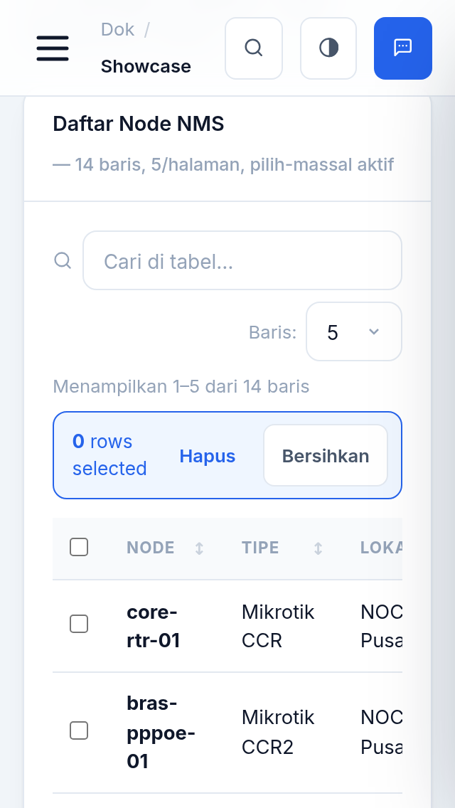

# 🏁 AWG-UIKIT-RACING

**Design system standalone** yang di-ekstrak dari UI dashboard Franchise Management (Frences).
Murni CSS + vanilla JS — **tanpa Bootstrap, tanpa jQuery** — bisa dipakai di PHP, Laravel,
Node.js, Python, Go, Ruby, React/Vue/Svelte, atau bahasa apa pun yang menghasilkan HTML.

## 📸 Preview

| Desktop (light) | Dark mode |
|---|---|
|  |  |

| Select2 — search + highlight | Select2 — multiple chips |
|---|---|
|  |  |

| Dropdown + submenu 2-level | Modal + select2 di dalamnya |
|---|---|
|  |  |

| Mobile 320px (0 scroll) | Mobile — sidebar drawer |
|---|---|
|  |  |

|| Charts NMS — desktop | Charts NMS — dark mode | Charts — tooltip crosshair |
|---|---|---|
|  |  |  |

|| **DataTable + bulk** | **Datepicker** | **Command palette ⌘K** |
|---|---|---|
|  |  |  |

|| **Wizard stepper** | **Treeview permission** | **Kanban drag-drop** |
|---|---|---|
|  |  |  |

|| **Lightbox** | **Mobile 320px — DataTable** | **Mobile 320px — Datepicker** |
|---|---|---|
|  |  |  |

|| Charts di HP 320px |
|---|
|  |

*Screenshot diambil dengan Chrome headless (viewport asli) — lihat `docs/screenshots/README.md`.*

| | |
|---|---|
| **Author** | **AWGNET-RACING & AGENT AI TEAM** |
| **Versi** | 1.2.0 |
| **Lisensi** | MIT |
| **Ukuran** | CSS ±10 KB + core ±3.5 KB + select2 ±3.6 KB + charts ±3.8 KB + datatable ±2.7 KB + datepicker ±2.5 KB + widgets ±3.7 KB + maps ±1.5 KB (gzip) |
| **Dependensi** | 0 — font Inter + ikon SVG self-hosted, tanpa CDN |

## Fitur utama v1.2
- 🗂️ **DataTable** (`awg-datatable.js`): pencarian, sort kolom, pagination, checkbox massal, format status/chip/lokasi, rows-per-page, event `awg:bulk`
- 📅 **Datepicker** (`awg-datepicker.js`): single & range, format Indonesia, batas min/max, navigasi keyboard (arrow / PgUp / PgDn / Enter / Esc), tombol *Hari ini* / *Bersihkan*
- 🧙 **Wizard** (`awg-widgets.js`): stepper bertahap dengan validasi per panel (bisa dimatikan), callback maju/mundur
- 🌳 **Treeview checkbox** untuk permission/hierarki: centang anak-ibu otomatis, collapse/expand, event `awg:tree`
- ⌨️ **Command palette** `Ctrl/Cmd+K`: cari perintah, filter realtime, keyboard ↑↓ Enter Esc
- 🏗️ **Kanban** drag-drop native HTML5: pindah kartu antar kolom, keyboard kiri/kanan, event `awg:kanban`
- 🖼️ **Lightbox** gambar: group swipe, navigasi panah, Escape tutup

## Fitur utama
- 🎨 **Design tokens** (Inter + slate + biru; `--awg-*`) — light & **dark mode** persist
- 🔤 **Font & ikon 100% lokal** — Inter woff2 (5 bobot) + sprite SVG ±60 ikon (`assets/icons.svg`), nol request keluar
- 📊 **Charts/NMS** (`awg-charts.js`): line/area multi-seri + crosshair tooltip, bar, donut, gauge zona ambang — SVG murni, tema-aware, live-update 2 dtk, responsif
- 📐 **App shell**: sidebar gelap + drawer mobile + topbar blur + grid + utilitas
- 🧩 **40+ komponen**: buttons, badges, chips, avatars, cards, stats, lists, tables
  (striped/compact/sticky/tfoot), alerts, toasts, empty-state, spinner, progress,
  skeleton, tooltip, popover, timeline, accordion, steps wizard, divider, tile kasir
- 📂 **Dropdown** menu + submenu 2 level + posisi (.left/.up) + integrasi baris tabel
- 🔍 **Select2-style** (`awg-select2.js`): searchable single/multi, option groups,
  **remote/async** dengan debounce, **tagging**, clearable, max-pick, keyboard penuh,
  **sinkron ke `<select>` asli** (form submit tetap standard)
- 🧾 **Forms**: input/select/textarea, input-group, floating label, switch, checkbox/radio,
  stepper, tags input, file dropzone (drag & drop), OTP auto-advance, range,
  **validasi deklaratif** (`data-awg-validate` + aturan `data-awg-email/number/min/max/pass`)
- 💬 **Overlays**: modal (sm/lg/fullscreen-HP), drawer panel, confirm dialog (API callback)
- 🖨️ Print stylesheet · 📱 Responsif teruji 320px+ · ♿ target sentuh 44px, aria pada combobox
- 🧩 **Komponen baru v1.2**: DataTable, Datepicker, Wizard, Treeview, Command Palette, Kanban, Lightbox

## Mulai cepat
```bash
git clone <repo> && cd awg-uikit-racing
bash scripts/build.sh              # minify → dist/
python3 -m http.server 8877        # buka http://localhost:8877/index.html  (showcase)
```
```html
<link rel="stylesheet" href="/assets/awg-uikit.min.css">
<script src="/assets/awg-core.min.js"></script>
<script src="/assets/awg-select2.min.js"></script>   <!-- opsional -->
<script src="/assets/awg-charts.min.js"></script>
<script src="/assets/awg-datatable.min.js"></script>
<script src="/assets/awg-datepicker.min.js"></script>
<script src="/assets/awg-widgets.min.js"></script>
<!-- deploy: salin folder dist/ (sudah berisi fonts/ + assets/icons.svg) ke public/assets/ -->
```

## Dokumentasi
- `docs/getting-started.md` — pasang, dark mode, layout dasar, prinsip, font/ikon lokal
- `docs/components.md` — semua komponen CSS
- `docs/charts.md` — grafik NMS: line/area/bar/donut/gauge + pola polling real-time
- `docs/forms.md` — field, kontrol, validasi, integrasi Laravel
- `docs/dropdown.md` — menu, submenu, popover, pola tabel
- `docs/select2.md` — searchable select (single/multi/remote/tag) + API
- `docs/js-api.md` — window.Awg / window.AwgChart / window.AwgSelect + aturan anti-XSS
- `adapters/README.md` — resep per stack (PHP/Laravel, Express, Flask, Go, React/Vue/Svelte)
- `templates/blade/` — app shell siap-copy untuk Laravel
- `css/tokens.json` — sumber token untuk tooling (SCSS/Tailwind config/Figma)

## Struktur
```
awg-uikit-racing/
├── css/    awg-uikit.css · tokens.json
├── js/     awg-core.js · awg-select2.js · awg-charts.js · awg-datatable.js · awg-datepicker.js · awg-widgets.js
├── fonts/  inter-{400..800}.woff2   (self-hosted)
├── assets/ icons.svg                 (sprite ±60 ikon)
├── dist/   hasil build (min + sumber + fonts/ + assets/)
├── docs/   getting-started · components · charts · forms · dropdown · select2 · js-api
├── templates/blade/  awg-layout · example-crud
├── adapters/README.md
├── scripts/build.sh
└── index.html   ← showcase interaktif semua komponen (termasuk dashboard NMS live)
```

## Prefix & konvensi
- Kelas: `awg-*` · Token CSS: `--awg-*` · Atribut: `data-awg-*` · Event: `awg:*` · Global: `window.Awg` / `window.AwgSelect`
- Komponen deklaratif memakai **event delegation** → aman untuk konten yang dirender via AJAX (hanya `AwgSelect.mount()` yang perlu dipanggil ulang)

## Roadmap (v2)
- Paket npm + CDN publik · virtual scroll pada select2/DataTable remote besar · RTL support · adapter Laravel Livewire

---
© **AWGNET-RACING & AGENT AI TEAM** — MIT License. Dipakai di Franchise Management & proyek ISP/FTTH tooling.
